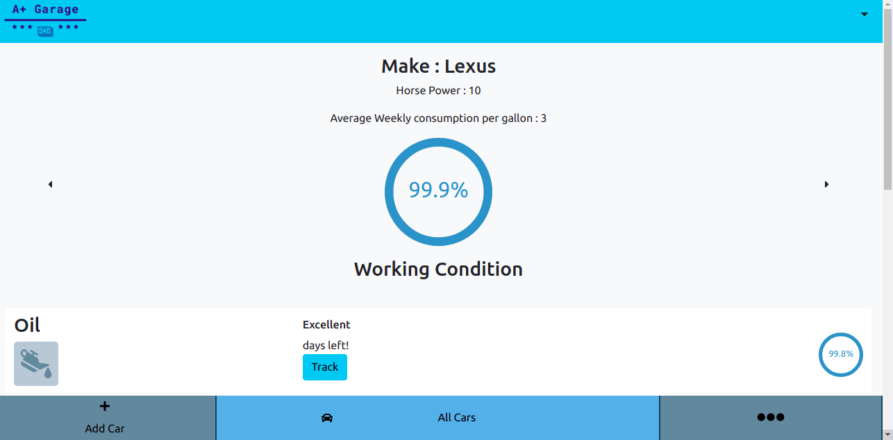

# A Plus Garage ~ React/Redux

This project is based on the requirements and specifications of Microverse final capstone project.

A full stack tracking app to track car parts using rails to save and handle data.
On the app, a user can:

- Sign up for an account
- Sign id to existing account
- Log out of account
- Create car objects
- Update car objects by car parts
- Delete car object

### [API Repo](https://github.com/wandji20/a-plus-garage-api.git)

# Project Preview

## [Live Link](https://a-plus-garage.netlify.app/)

## Built With

- JavaScript
- React
- Redux
- Bootstrap
- Jest
- Html
- Css

## Getting Started

To set up a local copy of the project

- `git clone https://github.com/wandji20/a-plus-garage.git`
- `cd a-plus-garage`
- `npm install`

### Run tests

- Go to your terminal
- Run `npm test` to run all the tests.

## Run locally

- Now you are ready to run a local server
- Go to your command line and put `npm start`
- Go to https://localhost:3000/
- Try it!!

## Author

👤 **Wandji Bertrand**

- Github: [@wandji20](https://github.com/wandji20)
- Twitter: [@wandjibertrand](https://twitter.com/wandjibertrand)
- Linkedin: [Linkedin](https://www.linkedin.com/in/wandji-bertrand/)

## 🤝 Contributing

Contributions, issues, and feature requests are welcome!

## Show your support

Give a ⭐️ if you like this project!

## 📝 [License](LICENSE)
